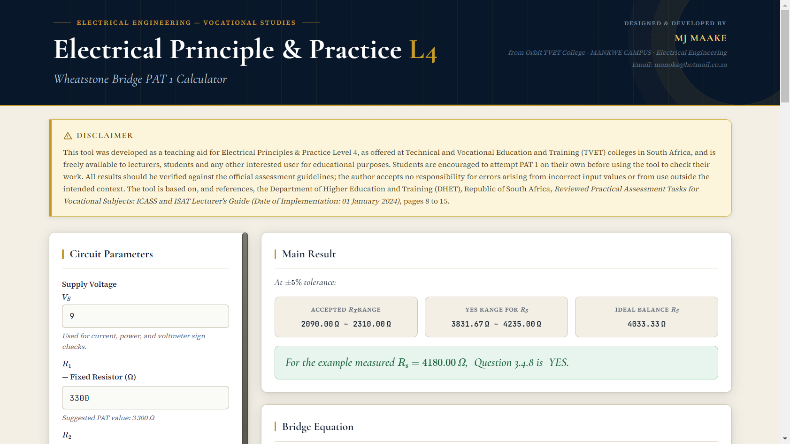

<div align="center">

# Wheatstone Bridge PAT 1

**Desktop calculator and teaching tool for the Wheatstone Bridge Practical Assessment Task**
Electrical Principles & Practice · NC(V) Level 4 · South African TVET

[](https://github.com/Manofork/wheatstone-bridge-pat1/actions/workflows/ci.yml)
[](https://github.com/Manofork/wheatstone-bridge-pat1/releases/latest)
[](https://github.com/Manofork/wheatstone-bridge-pat1/releases)
[](LICENSE)




</div>

## Contents

- [About](#about)
- [Features](#features)
- [Download](#download)
- [Build from source](#build-from-source)
- [Using the tool](#using-the-tool)
- [Theory](#theory)
- [Project structure](#project-structure)
- [Contributing](#contributing)
- [Releasing](#releasing)
- [Troubleshooting](#troubleshooting)
- [Acknowledgements](#acknowledgements)
- [Author](#author)
- [License](#license)

## About

Wheatstone Bridge PAT 1 is a desktop calculator and teaching tool for Electrical Principles & Practice,
Level 4, as offered at Technical and Vocational Education and Training (TVET) colleges in South Africa.
It supports Practical Assessment Task (PAT) 1, the Wheatstone bridge exercise, and is intended for
lecturers, students and any other interested user.

The tool is based on, and references, the Department of Higher Education and Training (DHET), Republic
of South Africa, *Reviewed Practical Assessment Tasks for Vocational Subjects: ICASS and ISAT Lecturer's
Guide (Date of Implementation: 01 January 2024)*, pages 8 to 15.

> **Notice.** This tool was developed as a teaching aid for Electrical Principles & Practice Level 4, as
> offered at Technical and Vocational Education and Training (TVET) colleges in South Africa, and is
> freely available to lecturers, students and any other interested user for educational purposes.
> Students are encouraged to attempt PAT 1 on their own before using the tool to check their work. All
> results should be verified against the official assessment guidelines; the author accepts no
> responsibility for errors arising from incorrect input values or from use outside the intended
> context.

## Features

- Live calculation of Rx tolerance band, Rs range and ideal Rs
- Question 3.4.8 decision table and YES / NO verdict
- Worked answers for Questions 3.4.3 to 3.4.8 with LaTeX rendering (MathJax)
- 9 V practical check with circuit schematic, currents and powers
- Voltmeter sign near balance
- Native print and Save as PDF (Ctrl+P)
- Reset to PAT defaults

## Download

Latest release: see the [Releases](https://github.com/Manofork/wheatstone-bridge-pat1/releases/latest) page.

| File | Use |
|---|---|
| `Wheatstone-Bridge-PAT1-Setup-x.y.z.exe` | Installer: Start Menu and Desktop shortcuts |
| `Wheatstone-Bridge-PAT1-Portable-x.y.z.exe` | Portable: runs from a USB stick, no install |
| `SHA256SUMS.txt` | Checksums to verify the downloads |

**Note on Windows SmartScreen.** The executables are not code signed, so Windows may show "Windows
protected your PC". Choose **More info → Run anyway**. Verify the checksum if in doubt:

```powershell
Get-FileHash .\file.exe -Algorithm SHA256
```

**Note.** Internet access is required on first launch for MathJax and Google Fonts.

## Build from source

Prerequisites: Git, Node.js 22 LTS.

```bash
git clone https://github.com/Manofork/wheatstone-bridge-pat1.git
cd wheatstone-bridge-pat1
npm ci
npm start          # run the app
npm run dist       # build installer and portable exe into dist/
```

Windows one click alternative: double click `BUILD.bat`.

To build your own release from a fork: update `version` in `package.json`, commit, then push a tag
matching the version, for example `v2.0.1`. The Release workflow (`.github/workflows/release.yml`)
builds and publishes automatically.

## Using the tool

### PAT default inputs

| Field | Value |
|---|---|
| Supply voltage, Vs | 9 V |
| R1 | 3300 Ω |
| R2 | 1800 Ω |
| Rx | 2200 Ω |
| Tolerance | 5 % |
| Rs | 4180 Ω |

### Expected results with the defaults above

| Quantity | Expected |
|---|---|
| Rx range (±5 %) | 2090.00 Ω to 2310.00 Ω |
| Rs range | 3831.67 Ω to 4235.00 Ω |
| Ideal Rs | 4033.33 Ω |
| Rx calculated from Rs = 4180 Ω | 2280.00 Ω (difference 80 Ω ≤ 110 Ω) |
| Question 3.4.8 verdict | YES |

### Keyboard shortcuts

| Shortcut | Action |
|---|---|
| Ctrl+P | Print or Save as PDF |
| F5 | Reload the window |

## Theory

The balance condition of a Wheatstone bridge is:

$$\frac{R_1}{R_2} = \frac{R_s}{R_x} \quad\Rightarrow\quad R_x = \frac{R_2\,R_s}{R_1}$$

The tolerance band for Rx is Rx(min, max) = Rx (1 ∓ tol), mapped to an Rs range through the same ratio.
Question 3.4.8 answers YES when the calculated Rx, derived from the measured Rs, differs from the stated
Rx by no more than Rx times the tolerance.

## Project structure

```
wheatstone-bridge-pat1/
├── .github/            Workflows, issue forms, PR template, CODEOWNERS, Dependabot
├── build/              Optional application icon
├── docs/               Reference image and generated screenshot
├── renderer/           index.html: the entire tool (styles, markup, logic)
├── scripts/            CI guard rail check and screenshot capture
├── BUILD.bat           One click Windows build script
├── main.js             Electron main process: window, menus, print bridge
├── preload.js          contextBridge: exposes window.electronAPI.print()
├── package.json        Metadata, scripts, electron-builder configuration
└── README.md           This file
```

## Contributing

See [CONTRIBUTING.md](CONTRIBUTING.md) and the [Code of Conduct](CODE_OF_CONDUCT.md).

## Releasing

1. Update `version` in `package.json` and in `CITATION.cff`, then run `npm install` so the lock file
   matches.
2. Move the `[Unreleased]` entries in `CHANGELOG.md` under the new version heading with the date.
3. Commit: `chore(release): vX.Y.Z`.
4. Tag: `git tag -a vX.Y.Z -m "…"` and push with `git push origin main --follow-tags`.
5. The Release workflow builds and publishes the installer, the portable executable and the checksum
   file automatically. It fails fast if the tag and `package.json` disagree.

## Troubleshooting

- **Blank window or missing formulas.** Confirm internet access; MathJax and the fonts load from a
  content delivery network on first run.
- **`npm install` fails behind a school proxy.** Configure npm's proxy settings, for example
  `npm config set proxy http://proxy.example:8080`, then retry.
  Electron's Chromium download is the usual cause of large, slow downloads; a stable connection is
  recommended.
- **Windows SmartScreen warning.** See the note under Download above.
- **Print preview is cut off or shows the toolbar.** Confirm the window was not resized below
  900 × 650 before printing, and retry Ctrl+P.

## Acknowledgements

Department of Higher Education and Training (DHET), Republic of South Africa, *Reviewed Practical
Assessment Tasks for Vocational Subjects: ICASS and ISAT Lecturer's Guide* (01 January 2024), pages 8 to
15.

## Author

MJ MAAKE · Orbit TVET College · MANKWE Campus · Electrical Engineering
Email: manoke@hotmail.co.za

## License

PolyForm Noncommercial License 1.0.0. See [LICENSE](LICENSE). Free for personal, educational and other
noncommercial use; commercial use or sale requires written permission from the author (email above).
